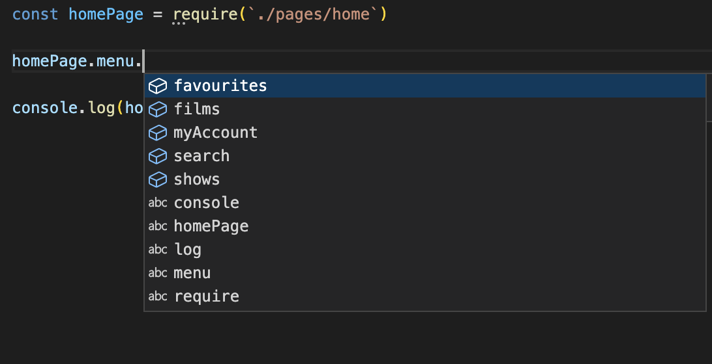

# One approach to using dynamic imports with intellisense.
(There willl be others, but this a simple one for our 'use case').

The `__template.js` file contains the 'shape' of the page object and any default values.
The android/web/whatever files only need to contain default overrides.

## Setup
npm install

## Run
```
CLIENT=android node myStepDefs.js
```
... gives you the home page for android:
```
{
  logo: '//*[@id="logo"]',
  menu: {
    search: '//[@id="search"]',
    myAccount: '//[@id = "android-account"]',
    films: '//[@id="films"]',
    shows: '//[@id="shows"]',
    favourites: '//[@class = "android-faves"]'
  }
}
```
(That's the default values, with any overrides specific to android.)

Now when you use the home page object, it's dynamic but you still get intellisense - for example, in `myStepDefs.js`:


